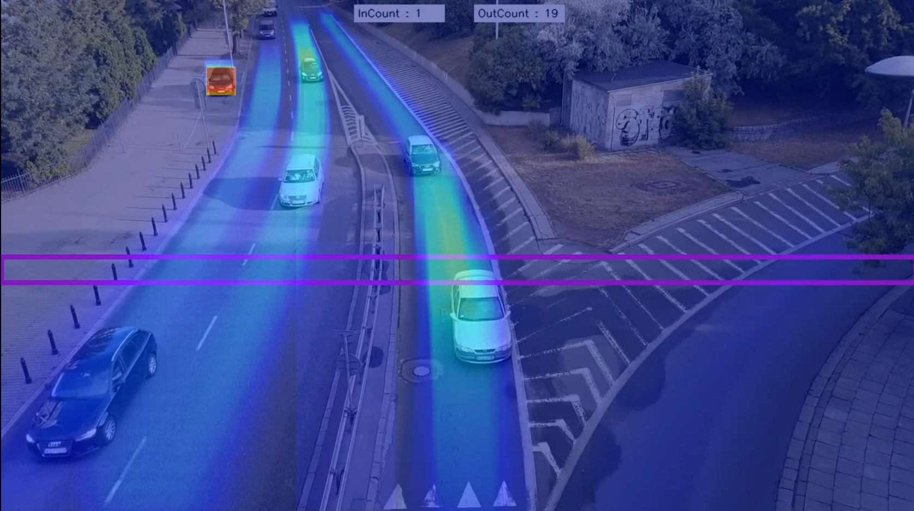

##  Unveiling Insights with Heatmap and Counting Objects using YOLOv8 

<br/>

**Output (Heatmap and Counter of Highway Video)**



<br/>

## Configurable parameters
In `demo.py` , change following parameters

1. Input Video Path
2. Counter Region Type(Horizontal, Vertical, Custom)
3. Output Video Path

## Demo 

```bash
python3 demo.py --weights yolov8s.pt --source input.mp4 --output_path output.mp4 --colormap_theme turbo
```
