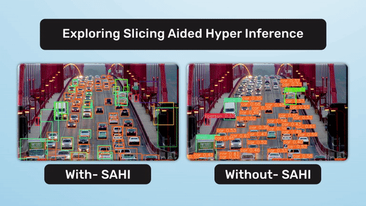

# YOLOv8 with SAHI 
SAHI is designed to optimize object detection algorithms for large-scale and high-resolution imagery. It partitions images into manageable slices, performs object detection on each slice, and then stitches the results back together. This tutorial will guide you through the process of running YOLOv8 inference on video files with the aid of SAHI.




# Install dependencies
```bash
pip install -r requirements.txt
```


#  Inference Video using YOLOv8 
```bash
#if you want to save results
python yolov8_demo.py --source "path/to/video.mp4" --save-img

#if you want to change model file
python yolov8_demo.py --source "path/to/video.mp4" --save-img --weights "yolov8n.pt"
```


#  Inference Video with SAHI using YOLOv8 
```bash
#if you want to save results
python yolov8_sahi_demo.py --source "path/to/video.mp4" --save-img

#if you want to change model file
python yolov8_sahi_demo.py --source "path/to/video.mp4" --save-img --weights "yolov8n.pt"
```